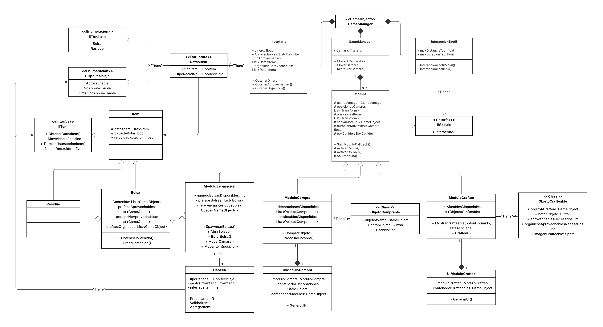
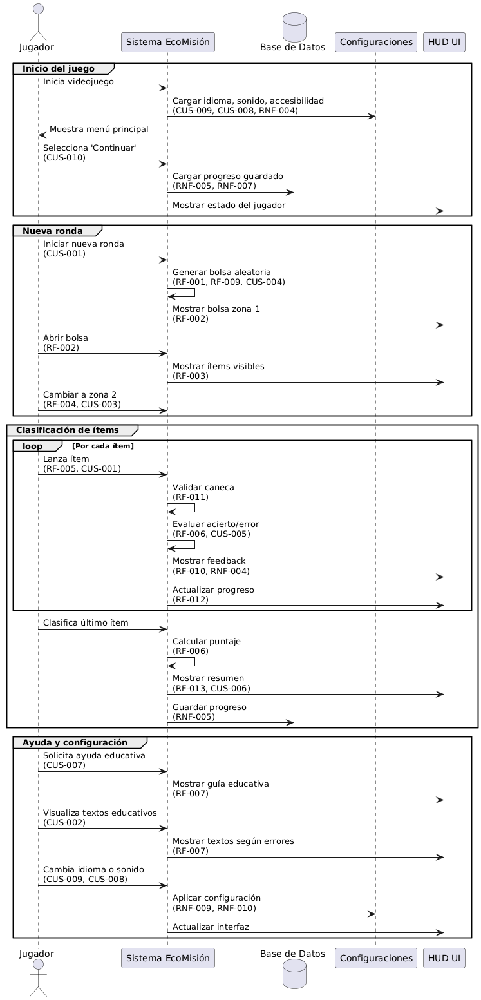

# 🧱 Arquitectura del Proyecto

Este documento describe la arquitectura general del proyecto, incluyendo el diseño de clases, interacciones entre componentes, y el flujo de ejecución de los sistemas principales del juego.

---

## 📌 Objetivo

Diseñar un sistema modular, escalable y desacoplado para facilitar la implementación y el mantenimiento de mecánicas como la interacción, la lógica de puzzles, y la administración del juego.

---

## 🧩 Patrones utilizados

- **Singleton**: Para GameManager, InputManager, etc.
- **Composición**: Separación de comportamientos en componentes.
- **Interfaces**: Para desacoplar acciones (`IModulo`, `IItem`, etc.).
- **Event-driven**: Uso de eventos para comunicar estados entre sistemas{}____.

---

## 🧬 Diagrama de clases

> Representa la relación entre los objetos principales del juego y cómo se comunican entre sí.

**Principales entidades:**

- `GameManager`: Controla el dinero del jugador y se comunica con objetos (Los modulos) que implementan `IIModulo`.
- `Modulo`: Controla si el modulo se encuentra activo, el tipo de modulo y despliega su funcionalidad.

> 📌 El uso de interfaces permite que los objetos interactivos puedan reaccionar de forma personalizada sin depender del tipo concreto del objeto.

---

## 🔄 Diagrama de secuencia

> Muestra el flujo de interacción cuando el jugador interactúa con los modulos.

---

## 🗂️ Archivos relacionados

- `/Scripts/Systems/GameManager.cs`
- `/Scripts/Interfaces/IIModulo.cs`
- `/Scripts/Modulos/Modulo.cs`

---

## 📎 Notas adicionales

- Los sistemas pueden evolucionar, por lo que este documento debe actualizarse al cambiar el diseño base.
- Se recomienda mantener los diagramas en `/Docs/imgs/` o una ruta similar para mantener el orden.
